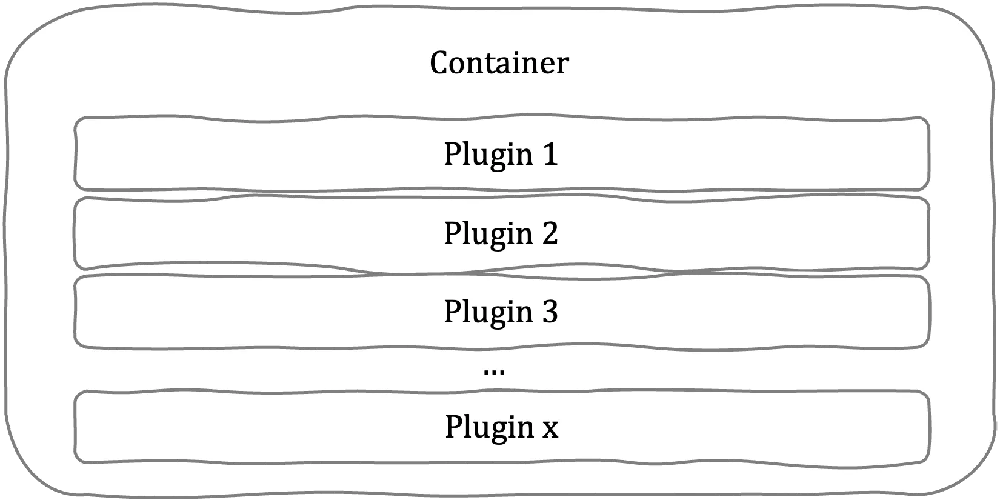

Dependency injection (DI) is a powerful pattern that Angular provides out of the box. Its capabilities can be enhanced using injection tokens.

In this article, I will demonstrate how to take advantage of injection tokens to create plugin-driven applications.

## Prerequisites

- Basic understanding of Angular components and modules
- Basic understanding of dependency injection pattern

## What is an injection token?

An injection token is a unique identifier used by the Angular dependency injection system to resolve dependencies. It can be used to inject any type of value, including primitives, objects, functions, and even other injection tokens.

You can define a provider with an injection token once or multiple times (using the “multi: true” property). In this article I will demonstrate a scenario, in which defining multiple providers with the same token is useful.

## The use case

Imagine that you are creating an app or a library that should be extensible with custom plugins that are provided from the outside of your code.



The simplest way would be to provide the plugins as an input property:

```typescript
<my-container [plugins]="plugins"></my-container>
```

This approach would do the job, but the plugins would be tightly coupled with the container. What we want to achieve here is to make plugins configurable from the outside, so in another words — injected into our container.

## The solution

The solution will be, obviously, using the injection token approach. This is how we can do it:

First let’s define the plugin interface and our custom injection token:

```typescript
export interface IPlugin {
  name: string;
  action: () => void;
}
```

import { InjectionToken } from '@angular/core';
import { IPlugin } from './plugin.interface';

export const PLUGIN_TOKEN = new InjectionToken<IPlugin>('PLUGIN_TOKEN');

````

Second, we should implement the my-container component so that it uses the plugins:

```typescript
import { ChangeDetectionStrategy, Component, inject } from '@angular/core';
import { IPlugin } from '../../plugins/plugin.interface';
import { PLUGIN_TOKEN } from '../../plugins/plugin.token';

@Component({
  selector: 'my-container',
  changeDetection: ChangeDetectionStrategy.OnPush,
  template: `
    <h1>My Container</h1>
    <button *ngFor="let plugin of plugins" (click)="plugin.action()">
      {{ plugin.name }}
    </button>
  `,
})
export class MyContainerComponent {
  plugins = inject<IPlugin[]>(PLUGIN_TOKEN);
}
````

Finally, we can implement the plugin code and inject them into our app.

```typescript
import { IPlugin } from "../../plugin.interface";

export class Plugin1 implements IPlugin {
  name: string = "Plugin 1";
  action: () => void = () => {
    alert("hello world");
  };
}
```

We can define as many plugins as we like, for this example let’s assume we defined Plugin1 and Plugin2.

```typescript
import { PLUGIN_TOKEN } from './plugins/plugin.token';
import { Plugin1 } from './plugins/plugin1/plugin1/plugin1';
import { Plugin2 } from './plugins/plugin1/plugin1/plugin2';

@NgModule({
  … // declarations, imports etc sections
  providers: [
    {
      provide: PLUGIN_TOKEN,
      multi: true,
      useClass: Plugin1,
    },
    {
      provide: PLUGIN_TOKEN,
      multi: true,
      useClass: Plugin2,
    },
    // we could provide here as many plugins as we want
    // as well as other providers unrelated to plugins
  ],
})
export class AppModule {}
```

## Summary

Even though the provided example is very simple, this exact mechanism can be used to create more complex implementations. Injection tokens are a powerful tool and there are many other use cases they can be applied to (but it’s a material for another story).

You can read more about injection tokens in the Angular Docs <https://angular.io/api/core/InjectionToken>
