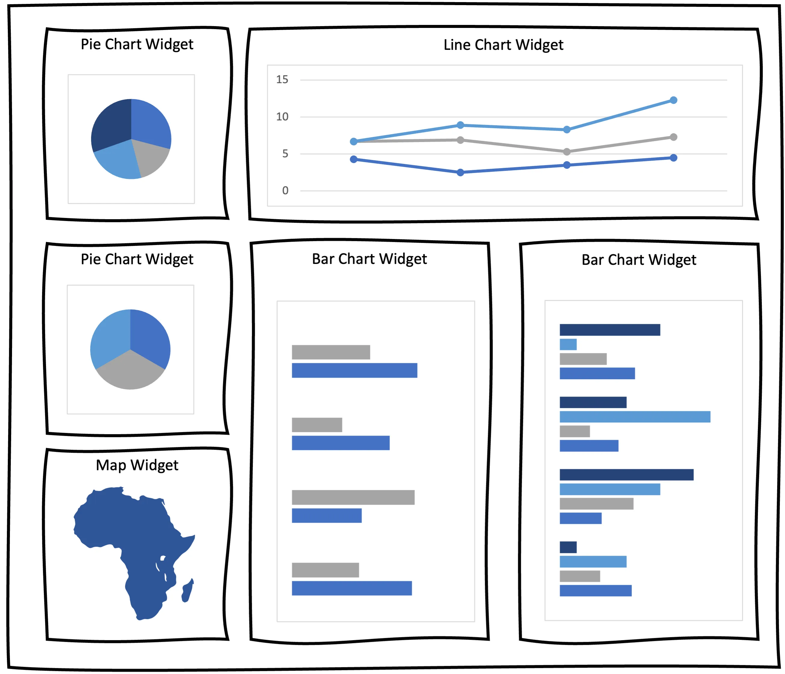

Sometimes you have to implement several similar components, that are displayed on your UI based on the provided conditions. Usually, you’d use the switch case clause for it (ngSwitch). But what if your switch case endlessly grows and gets more and more complicated? Here comes a factory pattern, that can largely improve your code.

In this article I will demonstrate how to create a simple and smooth component factory directive, that will insert the right components into your application at runtime. By the end of this read, you will learn how to switch from:

```html
<div *ngFor="let element of elements">
  <ng-container [ngSwitch]="element.type">
    <cmp-type-1 *ngSwitchCase="'type1'" [data]="element.data"></cmp-type-1>
    <cmp-type-2 *ngSwitchCase="'type2'" [data]="element.data"></cmp-type-2>
    ...
    <cmp-type-x *ngSwitchCase="'typeX'" [data]="element.data"></cmp-type-x>
  </ng-container>
</div>
```

```html
<div *ngFor="let element of elements">
  <ng-template
    [componentFactory]
    [type]="element.type"
    [data]="element.data"
  ></ng-template>
</div>
```

## Prerequisites

- Basic understanding of Angular components and templates
- Basic understanding of Angular directives

## The use case

Imagine, that you are working on a dynamic dashboard project. Users can customize the look of their dashboards by inserting, arranging, and configuring widgets with data.

As a developer, you provide a choice of widget types, each represented by a separate Angular component.



First, you need to create your widget components. Each widget type will be represented respectively by: `PieChartWidgetComponent`, `LineChartWidgetComponent`, `MapWidgetComponent` and `BarChartWidgetComponent`.

The simplest yet coarse solution to display your dashboard widgets would be to use the `NgSwitchCase`:

```html
<div *ngFor="let widget of dynamicWidgets">
  <ng-container [ngSwitch]="widget.type">
    <pie-chart-widget *ngSwitchCase="'PieChartWidget'" [data]="widget.data">
    </pie-chart-widget>
    <bar-chart-widget *ngSwitchCase="'BarChartWidget'" [data]="widget.data">
    </bar-chart-widget>
    <line-chart-widget *ngSwitchCase="'LineChartWidget'" [data]="widget.data">
    </line-chart-widget>
    <map-widget *ngSwitchCase="'MapWidget'" [data]="widget.data"> </map-widget>
  </ng-container>
</div>
```

This solution is simple, but as the number of widget types increase, this switch case will grow and become less and less readable. Let’s explore how we can accomplish the goal using the custom component factory directive.

## The solution

Before implementing the directive, define an enum with available widget types and an interface that all widget components must implement to ensure consistency.

```tsx
export enum WidgetType {
  LineChartWidget = "LineChartWidget",
  PieChartWidget = "PieChartWidget",
  BarChartWidget = "BarChartWidget",
  MapWidget = "MapWidget",
  // ... more widget types can be defined here
}
```

```tsx
export interface WidgetInterface {
  type: string;
  data: string;
}
```

Having the enum and the interface done, the widget component implementation should look something like this:

```tsx
@Component({
  selector: "bar-chart-widget",
  templateUrl: "./bar-chart-widget.component.html",
  styleUrls: ["./bar-chart-widget.component.scss"],
  standalone: true,
})
export class BarChartWidgetComponent implements WidgetInterface {
  type = WidgetType.BarChartWidget;
  data = {};

  // bar chart widget specific implementation goes here....
}
```

Now, to keep things organized, you can define a component map:

```tsx
export const widgetsMap: Record<WidgetType, Type<WidgetInterface>> = {
  [WidgetType.LineChartWidget]: LineChartWidgetComponent,
  [WidgetType.PieChartWidget]: PieChartWidgetComponent,
  [WidgetType.BarChartWidget]: BarChartWidgetComponent,
  [WidgetType.MapWidget]: MapWidget,
};
```

Finally, you can implement the directive:

```tsx
@Directive({ selector: "[widgetFactory]", standalone: true })
export class WidgetFactoryDirective implements OnChanges {
  private container = inject(ViewContainerRef);

  @Input() type?: WidgetType; // the type of the widget that should be inserted
  @Input() data?: string; // other properties, that should be passed into target widget component

  widgetComponent?: ComponentRef<AbstractWidgetComponent>;

  ngOnChanges(changes: SimpleChanges) {
    if (
      "type" in changes &&
      this.type &&
      changes["type"].previousValue !== changes["type"].currentValue
    ) {
      this.initWidget(this.type); // whenever the widget type is changed or provided initialy, init a widget
    }
    if ("data" in changes && this.data) {
      this.applyData(this.data); // whenever the widget data is changed, pass it on into target widget
    }
  }

  initWidget(type: WidgetType) {
    const widgetType: Type<AbstractWidgetComponent> = widgetsMap[type]; // retrieve the Type of the widget

    if (this.widgetComponent) {
      // if the widget has already been initiated, clear the container or else there would be duplicates
      this.container.clear();
      this.widgetComponent = undefined;
    }

    this.widgetComponent = this.container.createComponent(widgetType); // insert the widget component into container

    if (this.data) {
      // if data is already provided, pass it into the component instance
      this.widgetComponent.instance.data = this.data;
    }
  }

  applyData(data: string) {
    // pass the data into the component instance
    if (this.widgetComponent) {
      this.widgetComponent.instance.data = data;
      // if you are using the OnPush strategy in your widget components, you'll have to manually detect changes
    }
  }
}
```

And here is how you can use it:

```html
<div *ngFor="let widget of dynamicWidgets">
  <ng-template
    [widgetFactory]
    [type]="widget.type"
    [data]="widget.data"
  ></ng-template>
</div>
```

## The explanation

So what has actually happened here? You created a directive, that dynamically inserts a proper widget into your dashboard based on the provided type. This happens in the `initWidget` method.

To make your widget reflect the changes in the data property, you have to pass the new value to the actual widget component instance. This happens in the `applyData` method

## Summary

Even if this approach may look complex at first glimpse, I still recommend it over the `ngSwitchCase` approach if you anticipate that the number of cases will grow.

The common interface provides a shared foundation for your components and promotes readability and maintainability. If you want to share some code between the components, use and abstract class instead of the interface.

The dashboard widgets example is only one of many where this approach can prove useful. Other use cases might include:

- a modal dialog that displays different content based on user input.
- an ui that displays different elements based on the user’s role or permissions.
- a form builder that allows users to create custom forms at runtime.
- a drag-and-drop editor that allows users to create and manage complex layouts.

However, if your switch case is simple and unlikely to become more complex, stick with it to avoid overcomplicating your code.

## Further reading

<https://angular.io/guide/dynamic-component-loader>
<https://angular.io/api/core/ViewContainerRef#createComponent>
