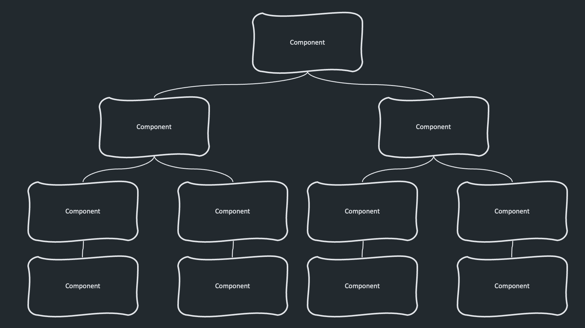

import StackBlitz from '../../../components/StackBlitz.astro';

When I first heard about Angular’s new feature, signals, I was like, “Wait, isn’t this just a Behavior Subject in disguise?". However, as I dived deeper into the topic, I discovered that signals are a whole different thing with whole different use cases.

In this article I’ll show you how using signals differ from subjects on the change detection level and how they can improve the performance of your Angular application. I’ll give you some general recommendations on when to use signals and when stick with RxJS.

## Prerequisites

- Basic understanding of RxJS Observables and Subjects
- Basic understanding of Angular change detection mechanism

## What are signals?

Signals are an implementation of the Observer Design Pattern. Signal wraps a value and notifies interested consumers when that value changes. Signals can be either writable or read-only.

You can create a writable signal using following syntax:

```tsx
const count = signal(1);
```

Having a signal defined, you can use it in your component’s template

```html
<div>Current signal value is: {{ count() }}</div>
```

Whenever you want to change the value of a writable signal, you can use `.set()` or `.update()` methods.

```tsx
count.set(3);
count.update((value) => value + 5);
```

As you execute `.set()` or `.update()` the change will be automatically reflected in your template.

Apart from writable signals, you can also create a read-only signal that is derived from other signals:

```tsx
const count: WritableSignal<number> = signal(0);
const doubleCount: Signal<number> = computed(() => count() * 2);
```

When you use a read-only(computed) signal doubleCount in your template, the change will be reflected as soon as the value of count changes.

## But hey, couldn’t we use Behavior Subject instead?

If you are like me, you could be thinking now: “wait… haven’t we already had all that with Behavior Subjects?”.

After all we could have defined the subject like this:

```tsx
const count = new BehaviorSubject(1);
```

Use it in the component’s template:

```html
<div>Current subject value is: {{ count | async }}</div>
```

Change it’s value with:

```tsx
count.next(3);
```

## The secret is what happens under the hood

As always, the devil’s in the details. Whenever you use the async pipe, under the hood Angular calls markForCheck. You can see the implementation for yourself here. This means that depending if you use OnPush or Default change detection strategy, either component branch or whole component tree will be rerendered.

| <div class="overflow-hidden rounded-lg"></div> |
|:--:|
| *Default Change Detection Strategy — whole component tree is updated on change* |

|  |
|:--:|
| *On Push Change Detection strategy — component’s branch is updated on change* |

With signals it’s different. Only the components that uses the changed signal will be rerendered.


| <div class="overflow-hidden rounded-lg"></div> |
|:--:|
| *Rerendering a component on signal value change* |

Take a look how it works in action. In the code below, there are three components — top level component, component using signal and component using behavior subject. As a component is rerendered, it’s highlighted in green. The sample uses On Push strategy, but feel free to play around with it.

<StackBlitz
  url="https://stackblitz.com/edit/signal-vs-subjects?ctl=1&embed=1&file=src%2Fmain.ts"
/>
  
## Should I stop using RxJS?

The answer is **no**.

Think of signals and observables as two different tools for different jobs.

Signals work synchronously but Observables can work both synchronously and asynchronously. Observables emit values (*value over time* concept), but signals have defined value at the given moment of time.

Signals and observables work together great because you can easily convert signals to observables and vice versa.

To covert signal to observable, use `toObservable` method:

```tsx
import { toObservable } from '@angular/core/rxjs-interop';
import { signal } from '@angular/core';

const convertSignalToObservable = () => {
  const value = signal('');
  const value$ = toObservable(value);
}
```

To convert observable to signal use toSignal method

```tsx
import { toSignal } from '@angular/core/rxjs-interop';
import { of } from 'rxjs';

const convertObservableToSignal = () => {
  const value$ = of(1);
  const value = toSignal(value$);
}
```

## When should I use signals and when RxJS?

As always in programming — it depends. However my general recommendation would be to use signals on the component level, but on the deeper layers (such as services, http interceptors etc) continue with RxJS.

## Conclusion

Signals are new and powerful feature of Angular with a potential to revolutionize the way we create our apps. Moving towards signal based components should speed up our applications and simplify developers’ life. Signals will work without Zone.JS, so Angular apps will get lighter. With these changes, Angular is definitely here to stay as a great and modern frontend framework!

## Further reading

- [https://angular.io/guide/signals](https://angular.io/guide/signals)
- [https://www.builder.io/blog/signals-vs-observables](https://www.builder.io/blog/signals-vs-observables)
- [https://netbasal.com/converting-signals-to-observables-in-angular-what-you-need-to-know-971eacd3af2](https://netbasal.com/converting-signals-to-observables-in-angular-what-you-need-to-know-971eacd3af2)
- [https://medium.com/ngconf/future-of-change-detection-in-angular-with-signals-fb367b66a232](https://medium.com/ngconf/future-of-change-detection-in-angular-with-signals-fb367b66a232)
