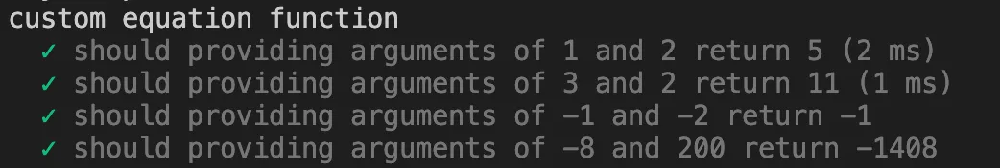

Jest is a popular JavaScript testing framework that allows you to write and run tests for your code.

In this article I will show you how to use parameterized testing, to test multiple test cases within a single test.

## What is parametrized testing and why should you use it?

Parametrized testing is a technique of writing and running tests with different inputs and outputs, without having to write multiple test methods for each scenario.

Imagine following scenario: you have created a function that solves simple mathematical equation:

```tsx
export function solveCustomEquation(a: number, b: number): number {
  return a * b + (a + b);
}
```

Now you want to make sure, that your function always returns the correct result. In order to do so, you could create a Unit Test.

```tsx 
describe('custom equation function', () => {
    it('should providing arguments of 1 and 2 return 5', () => {
      const result = solveCustomEquation(1, 2);
      expect(result).toEqual(5);
    });
  });
```

But here is a catch — there are multiple other equations that will return 5 if 1 and 2 is provided, but other (invalid) results when other entry arguments are provided.

To make sure, that your function really does what it's supposed to do, you should test other entry arguments. You could write another jest `it`, but instead let's parametrize our test to make the code more brief and readable.

## Let’s parametrize our test

To parametrize the test we can use it.each syntax.

```tsx
describe('custom equation function', () => {
    const testData = [
      { inputParam1: 1, inputParam2: 2, expectedValue: 5 },
      { inputParam1: 3, inputParam2: 2, expectedValue: 11 },
      { inputParam1: -1, inputParam2: -2, expectedValue: -1 },
      { inputParam1: -8, inputParam2: 200, expectedValue: -1408 },
    ];

    it.each(testData)(
      'should providing arguments of $inputParam1 and $inputParam2 return $expectedValue',
      ({inputParam1, inputParam2, expectedValue}) => {
        const result = solveCustomEquation(inputParam1, inputParam2);
        expect(result).toEqual(expectedValue);
      }
    );
  });
```

When we run our test, the result will look something like this:

| <div class="overflow-hidden rounded-lg"></div> |
|:--:|
| *Jest run result* |

We ran a separate test for each test case and parametrized the test description so that it’s easy to identify the executed case precisely. This facilitates future debugging if any test fails.

Note also, that testData type is an array. In the example above, I provided the array of objects, but nothing stops you from providing and array of array with naked data. However, I encourage you to use objects to improve the readability of the code.

## Summary

- Use parametrized testing to make sure that your functions do what you intend them to do
- Provide your test data as an array of objects to improve readability
- Use parameterized test descriptions to get meaningful results from Jest
- Do write tests ;)


## Further reading
- [https://jestjs.io/docs/api#testeachtablename-fn-timeout](https://jestjs.io/docs/api#testeachtablename-fn-timeout)
